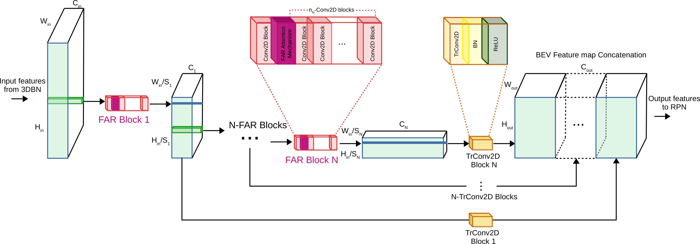
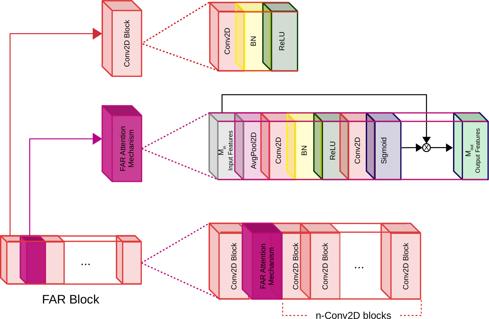

{ width: 200px; }

# FAR
This is the official implementation of "Feature Aware Re-weighting (FAR) in Bird’s Eye View for LiDAR-based 3D object detection in autonomous driving applications" paper, that you can download [here](). 
This project is built on [OpenPCDet](https://github.com/open-mmlab/OpenPCDet).

## Requirements

All the codes are tested in the following environment:

- Linux (tested on Ubuntu 18.04)
- Python 3.8.8
- PyTorch 1.10
- CUDA 11.1

- ## Install
1. Install the spconv library from [spconv](https://github.com/traveller59/spconv).
2. Install pytorch 1.10 `conda install pytorch==1.10.0 torchvision==0.11.0 torchaudio==0.10.0 cudatoolkit=11.1 -c pytorch -c conda-forge`
3. Install requirements `pip install -r requirements.txt`
4. Install pcdet library `python setup.py develop`

### KITTI 3D Object Detection Baselines
Selected supported methods are shown in the below table. The results are the 3D detection performance of moderate difficulty on the *val* set of KITTI dataset. All models are trained on a single RTX 3090 GPU.

|                                             | Car@R11 | Pedestrian@R11 | Cyclist@R11  | weights |
|---------------------------------------------|:-------:|:-------:|:-------:|:---------:|
| [PointPillar_FAR](tools/cfgs/kitti_models/pointpillar_FAR.yaml) | 76.87 | 52.05 | 63.63 | [model](https://vc.ee.duth.gr:6960/index.php/s/0krLEwFNkHrN4Wz) | 
| [CenterPoint_FAR](tools/cfgs/kitti_models/centerpoint_dyn_pillar_1x_FAR.yaml) | 76.73 | 50.72 | 65.10 | [model](https://vc.ee.duth.gr:6960/index.php/s/j2r54j77MsTgyVu)| 
| [SECOND_FAR](tools/cfgs/kitti_models/second_FAR.yaml)       | 78.30 | 53.92 | 67.27 | [model](https://vc.ee.duth.gr:6960/index.php/s/g95yytjRRdSwAwG) |
| [PV-RCNN_FAR](tools/cfgs/kitti_models/pv_rcnn_FAR.yaml) |83.38 | 60.43 | 72.47 | [model](https://vc.ee.duth.gr:6960/index.php/s/g95yytjRRdSwAwG) |
| [Voxel R-CNN_FAR (all classes)](tools/cfgs/kitti_models/voxel_rcnn_all_classes_FAR.yaml) | 83.89 | 60.76 | 72.18 | [model](https://vc.ee.duth.gr:6960/index.php/s/JK3KAIC2Ze3SLG2) |

### Waymo Open Dataset Baselines

By default, all models are trained with **a single frame** of **20% data (~32k frames)** of all the training samples on a single RTX 3090 GPU, and the results of each cell here are mAP calculated by the official Waymo evaluation metrics on the **whole** validation set (version 1.2).    

|    Performance@(train with 20\% Data)            | Vec_L1 | Vec_L2 | Ped_L1 | Ped_L2 | Cyc_L1 | Cyc_L2 |  
|---------------------------------------------|----------:|:-------:|:-------:|:-------:|:-------:|:-------:|
| [PointPillar_FAR](tools/cfgs/waymo_models/pointpillar_1x_FAR.yaml) | 71.30 |	63.02 | 67.15|58.90|58.26|56.06 |
| [CenterPoint_FAR-Dynamic-Pillar](tools/cfgs/waymo_models/centerpoint_dyn_pillar_1x_FAR.yaml)| 71.49|63.24|74.30|66.20|66.63|64.13| 
| [SECOND_FAR](tools/cfgs/waymo_models/centerpoint_dyn_pillar_1x_FAR.yaml) | 71.13|62.86|65.78|57.83|	59.18 |	56.99| 
| [PV-RCNN_FAR (AnchorHead)](tools/cfgs/waymo_models/pv_rcnn_FAR.yaml) | 75.17|66.59|72.19|63.17|67.27|64.76|
| [Voxel R-CNN_FAR (CenterHead)-Dynamic-Voxel](tools/cfgs/waymo_models/voxel_rcnn_with_centerhead_dyn_voxel_FAR.yaml) | 76.18|67.76|77.95|69.28|71.15|68.53|

### NuScenes 3D Object Detection Baselines
All models are trained on a single RTX 3090 GPU and are available for download.

|                                             | mATE | mASE | mAOE | mAVE | mAAE | mAP | NDS | download | 
|---------------------------------------------|----------:|:-------:|:-------:|:-------:|:---------:|:-------:|:-------:|:---------:|
| [PointPillar_FAR-MultiHead](tools/cfgs/nuscenes_models/cbgs_pp_multihead_FAR.yaml) | 33.88 | 25.99 | 31.73 | 28.57 | 20.24 | 45.38 | 58.65	 | [model](https://vc.ee.duth.gr:6960/index.php/s/bYjGx4uKny9S6E4) | 
| [SECOND_FAR-MultiHead (CBGS)](tools/cfgs/nuscenes_models/cbgs_second_multihead_FAR.yaml) | 31.64 |	25.56 |	27.14 | 25.48 | 19.84 | 51.31 | 62.69 | [model](https://vc.ee.duth.gr:6960/index.php/s/6vc1t6m3xsqnskz) |
| [CenterPoint_FAR-PointPillar](tools/cfgs/nuscenes_models/cbgs_dyn_pp_centerpoint_FAR.yaml) | 30.94 |	25.81 |	41.52 | 23.55 | 19.36 | 52.05 | 61.91 | [model](https://vc.ee.duth.gr:6960/index.php/s/PL5PuwSyFYBjspk) |

